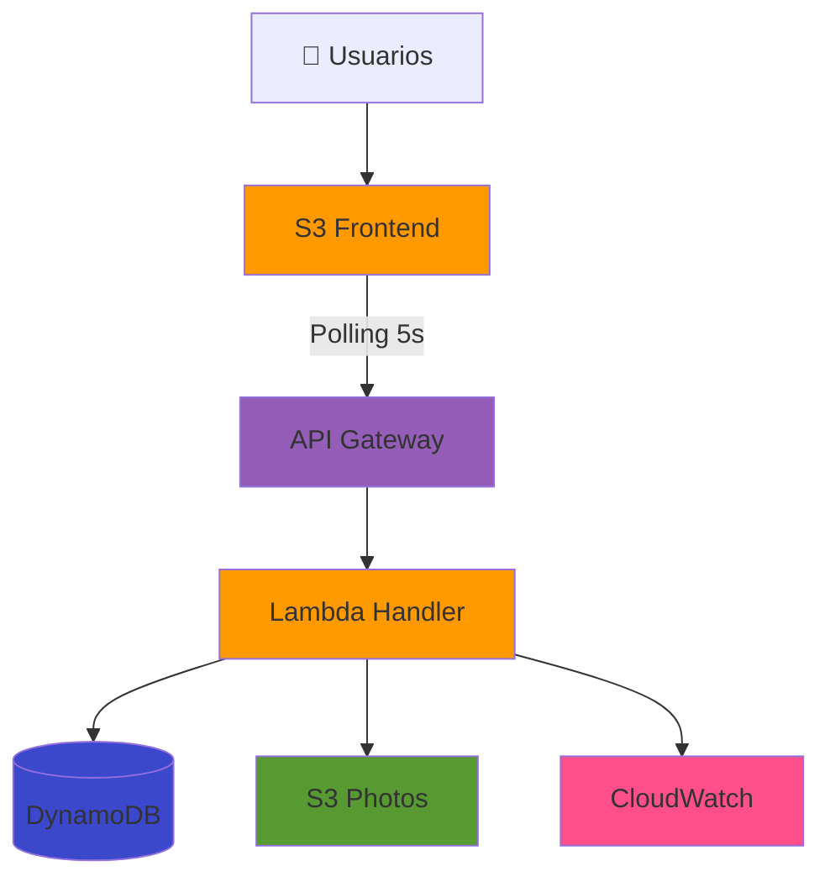
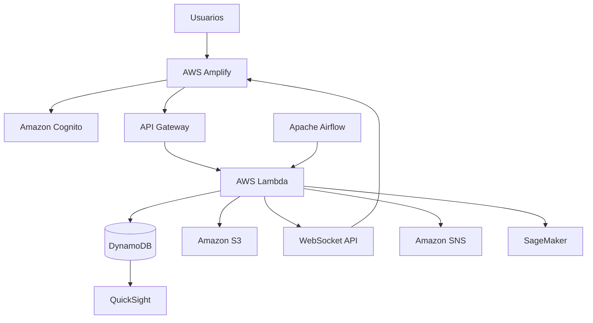

# Diagrama de Arquitectura AlertaUTEC - MVP 24 Horas

## 🎯 Instrucciones de Uso

1. Ve a https://app.eraser.io/
2. Crea un nuevo documento
3. Selecciona el modo "Diagram as Code"
4. Copia y pega el código del **MVP Simplificado** (recomendado para presentación)
5. El diagrama se generará automáticamente

---

## 🚀 Código del Diagrama - MVP SIMPLIFICADO (Recomendado)

Este es el diagrama para tu implementación real en 24 horas:

```
title AlertaUTEC MVP - Arquitectura Serverless 24h (AWS Lab)

// ============================================
// USUARIOS
// ============================================
Users [icon: users, color: blue] {
  Estudiantes
  Personal
  Autoridades
  
  (Sin Cognito - Selector de rol simple)
}

// ============================================
// FRONTEND (S3 Static Website)
// ============================================
Frontend [icon: aws-s3, color: orange] {
  S3 Static Website
  Bucket: alertautec-frontend
  
  HTML/CSS/JavaScript
  Bootstrap UI
  Polling cada 5 segundos
}

// ============================================
// API REST
// ============================================
API Gateway [icon: aws-api-gateway, color: purple] {
  REST API
  
  POST /incidents (crear)
  GET /incidents (listar)
  GET /incidents/{id} (detalle)
  PUT /incidents/{id} (actualizar)
  POST /presigned-url (foto)
  
  CORS habilitado
}

// ============================================
// BACKEND SERVERLESS
// ============================================
Lambda [icon: aws-lambda, color: orange] {
  Función: incident-handler
  Runtime: Python 3.11 / Node.js 18
  
  CRUD completo
  Validación de roles
  Presigned URLs
  
  Timeout: 30s
  Memory: 512 MB
}

// ============================================
// BASE DE DATOS
// ============================================
DynamoDB [icon: aws-dynamodb, color: blue] {
  Tabla: alertautec-incidents
  
  PK: incidentId (UUID)
  
  Attributes:
    - tipo, ubicacion, descripcion
    - urgencia, estado
    - reportadoPor, rolReportador
    - fotoUrl, createdAt, updatedAt
  
  Capacity: On-demand
}

// ============================================
// ALMACENAMIENTO FOTOS
// ============================================
S3 Photos [icon: aws-s3, color: green] {
  Bucket: alertautec-photos
  
  Fotos de incidentes
  Presigned URLs (10 min)
  CORS habilitado
  Private bucket
}

// ============================================
// MONITOREO
// ============================================
CloudWatch [icon: aws-cloudwatch, color: red] {
  Logs automáticos
  Lambda logs
  API Gateway logs
  
  Sin alarmas (MVP)
}

// ============================================
// FLUJOS PRINCIPALES
// ============================================

// Flujo de acceso
Users > Frontend : "1. Abre web (HTTPS)"

// Flujo de login simple
Frontend > Frontend : "2. Selecciona rol (localStorage)"

// Flujo de crear incidente
Frontend > API Gateway : "3a. POST /incidents (crear)"
API Gateway > Lambda : "3b. Invoke function"
Lambda > DynamoDB : "3c. PutItem (guardar)"
Lambda > API Gateway : "3d. Return 201"
API Gateway > Frontend : "3e. Confirmación"

// Flujo de upload foto
Frontend > API Gateway : "4a. POST /presigned-url"
API Gateway > Lambda : "4b. Generate presigned URL"
Lambda > S3 Photos : "4c. Generate URL"
Lambda > API Gateway : "4d. Return URL"
API Gateway > Frontend : "4e. Presigned URL"
Frontend > S3 Photos : "4f. PUT photo (direct upload)"

// Flujo de listar incidentes
Frontend > API Gateway : "5a. GET /incidents (cada 5s)"
API Gateway > Lambda : "5b. Invoke"
Lambda > DynamoDB : "5c. Scan table"
Lambda > API Gateway : "5d. Return array"
API Gateway > Frontend : "5e. Update UI"

// Flujo de actualizar estado (autoridad)
Frontend > API Gateway : "6a. PUT /incidents/{id}"
API Gateway > Lambda : "6b. Validate role=autoridad"
Lambda > DynamoDB : "6c. UpdateItem (estado)"
Lambda > API Gateway : "6d. Return 200"
API Gateway > Frontend : "6e. Success"

// Polling
Frontend > Frontend : "7. setInterval 5s (polling)"

// Monitoreo
Lambda > CloudWatch : "Logs automáticos"
API Gateway > CloudWatch : "Logs automáticos"

// ============================================
// ROADMAP FUTURO (Fase 2)
// ============================================

Cognito Future [icon: aws-cognito, color: gray, style: dashed] {
  Amazon Cognito
  (Fase 2)
  
  Autenticación robusta
  MFA
  User pools
}

WebSocket Future [icon: aws-api-gateway, color: gray, style: dashed] {
  WebSocket API
  (Fase 2)
  
  Tiempo real <100ms
  DynamoDB Streams
}

Airflow Future [icon: airflow, color: gray, style: dashed] {
  Apache Airflow MWAA
  (Fase 2)
  
  Clasificación automática
  Notificaciones
  Reportes
}

SageMaker Future [icon: aws-sagemaker, color: gray, style: dashed] {
  Amazon SageMaker
  (Fase 2)
  
  ML clasificación
  Predicción urgencia
  Zonas de riesgo
}

// Conexiones roadmap
Cognito Future > API Gateway : "Future: Auth robusta" [style: dashed]
WebSocket Future > Frontend : "Future: Push real-time" [style: dashed]
Airflow Future > Lambda : "Future: Workflows" [style: dashed]
SageMaker Future > Lambda : "Future: ML predictions" [style: dashed]

// ============================================
// NOTAS
// ============================================

// LEYENDA:
// - Líneas sólidas: MVP implementado (24h)
// - Líneas punteadas: Roadmap Fase 2
// - Colores: Azul=Datos, Naranja=Compute, Verde=Storage, Rojo=Monitoreo
```

---

## 📊 Diagrama Completo con Roadmap (Para Documentación)

Este diagrama incluye todos los servicios mencionados, ideal para la presentación:

```
title AlertaUTEC - Arquitectura Completa (MVP + Roadmap)

// ============ MVP (SÓLIDO) ============

Users [icon: users] > Frontend [icon: aws-s3]
Frontend > API Gateway REST [icon: aws-api-gateway]
API Gateway REST > Lambda Functions [icon: aws-lambda]
Lambda Functions > DynamoDB [icon: aws-dynamodb]
Lambda Functions > S3 Photos [icon: aws-s3]
Lambda Functions > CloudWatch [icon: aws-cloudwatch]

Frontend > Frontend : "Polling 5s"

// ============ ROADMAP (PUNTEADO) ============

Cognito [icon: aws-cognito, style: dashed] > API Gateway REST : "Fase 2" [style: dashed]
API Gateway WebSocket [icon: aws-api-gateway, style: dashed] > Frontend : "Fase 2" [style: dashed]
DynamoDB > DynamoDB Streams [icon: aws-dynamodb, style: dashed] : "Fase 2" [style: dashed]
DynamoDB Streams > Lambda Functions : "Fase 2" [style: dashed]
Lambda Functions > API Gateway WebSocket : "Fase 2" [style: dashed]

Airflow [icon: airflow, style: dashed] > Lambda Functions : "Fase 2" [style: dashed]
Airflow > S3 Reports [icon: aws-s3, style: dashed] : "Fase 2" [style: dashed]
Airflow > SNS [icon: aws-sns, style: dashed] : "Fase 2" [style: dashed]

SageMaker [icon: aws-sagemaker, style: dashed] > Lambda Functions : "Fase 2" [style: dashed]
S3 ML Data [icon: aws-s3, style: dashed] > SageMaker : "Fase 2" [style: dashed]

QuickSight [icon: aws-quicksight, style: dashed] > DynamoDB : "Fase 2 BI" [style: dashed]
```

---

## 🎨 Versión Visual para PowerPoint (Texto Plano)

Si Eraser.io no funciona, usa esta descripción para crear el diagrama manualmente:

### Componentes del MVP (En sólido):

**Capa 1 - Usuarios**
- 👥 Estudiantes, Personal, Autoridades

**Capa 2 - Frontend**
- 🪣 S3 Static Website (`alertautec-frontend`)
- HTML/CSS/JavaScript con Bootstrap
- Polling cada 5 segundos

**Capa 3 - API**
- 🔌 API Gateway REST API
- 5 endpoints (POST, GET, GET/{id}, PUT, POST presigned)

**Capa 4 - Backend**
- ⚡ AWS Lambda (`incident-handler`)
- Python 3.11 o Node.js 18

**Capa 5 - Datos**
- 🗄️ DynamoDB (`alertautec-incidents`)
- Tabla única con PK=incidentId

**Capa 6 - Storage**
- 🪣 S3 (`alertautec-photos`)
- Fotos con presigned URLs

**Capa 7 - Monitoreo**
- 📊 CloudWatch Logs (automático)

### Componentes Roadmap (En punteado):

- 🔐 **Amazon Cognito** → Autenticación robusta (Fase 2)
- 🔌 **WebSocket API** → Tiempo real <100ms (Fase 2)
- 🔄 **Apache Airflow** → Orquestación workflows (Fase 2)
- 🤖 **SageMaker** → ML y predicciones (Fase 2)
- 📧 **SNS/SES** → Notificaciones email/SMS (Fase 2)
- 📈 **QuickSight** → Dashboards y analytics (Fase 2)

### Flujos (Flechas):

1. **Usuario → Frontend**: Acceso HTTPS
2. **Frontend → API Gateway**: Requests (POST/GET/PUT)
3. **API Gateway → Lambda**: Invoke function
4. **Lambda → DynamoDB**: CRUD operations
5. **Lambda → S3**: Upload fotos (presigned URL)
6. **Lambda → CloudWatch**: Logs automáticos
7. **Frontend ⟳ Frontend**: Polling cada 5s

---

## 🛠️ Alternativas si Eraser.io no Funciona

### Opción 1: Draw.io (diagrams.net)
1. Ve a https://app.diagrams.net/
2. Usa los iconos de AWS: File → Open Library → AWS 19
3. Arrastra componentes
4. Conecta con flechas
5. Exporta como PNG

### Opción 2: Lucidchart
1. Plantilla "AWS Architecture Diagram"
2. Drag & drop
3. Exportar como PDF

### Opción 3: Mermaid (para README.md)



### Opción 4: PowerPoint con Iconos AWS

1. Descarga iconos oficiales: https://aws.amazon.com/architecture/icons/
2. Crea diagrama en PowerPoint
3. Usa flechas para conexiones
4. Agregar leyenda: MVP (sólido) vs Roadmap (punteado)

---

## 📐 Especificaciones del Diagrama

### Dimensiones Recomendadas:
- **Presentación**: 1920x1080px (landscape)
- **Documento**: Tamaño A4
- **GitHub README**: 1200px ancho

### Paleta de Colores (AWS Style):
- **Compute** (Lambda): `#FF9900` (naranja)
- **Storage** (S3): `#569A31` (verde)
- **Database** (DynamoDB): `#3B48CC` (azul)
- **Network** (API Gateway): `#945EB8` (púrpura)
- **Security** (Cognito): `#DD344C` (rojo)
- **Management** (CloudWatch): `#FF4F8B` (rosa)
- **Analytics** (SageMaker): `#01A88D` (teal)

### Iconografía:
- ✅ Sólido = MVP implementado
- ⏳ Punteado = Roadmap futuro
- ➡️ Flecha negra = Flujo principal
- ⤷ Flecha gris punteada = Flujo futuro

---

## 💡 Tips para la Presentación

### En el Diagrama Destacar:

1. **MVP Core** (rodeado en verde):
   - S3 Frontend
   - API Gateway
   - Lambda
   - DynamoDB
   - S3 Photos

2. **"Tiempo Real"** (badge):
   - Polling cada 5 segundos
   - "Mejora futura: WebSocket <100ms"

3. **Roadmap** (caja punteada):
   - Cognito
   - Airflow
   - SageMaker
   - WebSocket

### Anotaciones Recomendadas:

- **"24 horas"** junto al MVP
- **"Fase 2"** junto al roadmap
- **"$0 costo"** junto a los servicios
- **"Capa gratuita AWS"** en nota al pie

---

## 🎯 Checklist del Diagrama

Antes de la presentación, verifica que el diagrama muestre:

- [ ] Todos los servicios AWS del MVP (5 mínimo)
- [ ] Flujos principales con flechas numeradas
- [ ] Diferenciación visual MVP vs Roadmap
- [ ] Leyenda explicativa
- [ ] Título claro: "AlertaUTEC MVP 24h"
- [ ] Iconos de AWS oficiales (si es posible)
- [ ] Paleta de colores consistente
- [ ] Readable en proyector (fuente >12pt)

---

## 📸 Ejemplos de Uso

### En GitHub README:
```markdown
## Arquitectura


### Componentes MVP (24 horas)
- **Frontend**: S3 Static Website con polling
- **API**: API Gateway REST + Lambda
- **Datos**: DynamoDB + S3


// ============================================
// CAPA DE HOSTING Y CDN
// ============================================

AWS Amplify [icon: aws-amplify, color: orange] {
  Frontend (React/Vue)
  CI/CD desde GitHub
  HTTPS + CloudFront CDN
}

// ============================================
// CAPA DE AUTENTICACIÓN
// ============================================

Amazon Cognito [icon: aws-cognito, color: red] {
  User Pools
  Grupos de Usuarios (Roles)
  JWT Tokens
  MFA (Opcional)
}

// ============================================
// CAPA DE API
// ============================================

API Gateway REST [icon: aws-api-gateway, color: purple] {
  POST /incidents
  GET /incidents
  PUT /incidents/{id}
  DELETE /incidents/{id}
  GET /users
}

API Gateway WebSocket [icon: aws-api-gateway, color: purple] {
  $connect
  $disconnect
  $default (mensajes)
  Real-time updates
}

AWS WAF [icon: aws-waf, color: red] {
  Rate Limiting
  SQL Injection Protection
  XSS Protection
}

// ============================================
// CAPA DE LÓGICA DE NEGOCIO
// ============================================

Lambda Functions [icon: aws-lambda, color: orange] {
  createIncident()
  updateIncident()
  getIncidents()
  deleteIncident()
  classifyIncident()
  notifyUsers()
  wsConnect()
  wsDisconnect()
  wsSendMessage()
}

// ============================================
// CAPA DE BASE DE DATOS
// ============================================

DynamoDB Tables [icon: aws-dynamodb, color: blue] {
  Incidents Table
    - PK: incidentId
    - GSI: statusIndex
    - GSI: urgencyIndex
    - GSI: locationIndex
  
  Users Table
    - PK: userId
  
  IncidentHistory Table
    - PK: incidentId
    - SK: timestamp
  
  WebSocketConnections Table
    - PK: connectionId
}

DynamoDB Streams [icon: aws-dynamodb, color: blue] {
  Eventos en tiempo real
  Trigger de cambios
}

// ============================================
// CAPA DE ALMACENAMIENTO
// ============================================

Amazon S3 [icon: aws-s3, color: green] {
  alerta-utec-incident-media/
    - Fotos de incidentes
    - Videos
  
  alerta-utec-reports/
    - Reportes PDF
    - Estadísticas
  
  alerta-utec-ml-data/
    - Datasets ML
    - Modelos entrenados
}

// ============================================
// CAPA DE NOTIFICACIONES
// ============================================

Amazon SNS [icon: aws-sns, color: pink] {
  Topic: critical-incidents
  Topic: general-updates
  Push, Email, SMS
}

Amazon SES [icon: aws-ses, color: pink] {
  Email Templates
  Notificaciones a Autoridades
}

// ============================================
// CAPA DE ORQUESTACIÓN
// ============================================

Apache Airflow MWAA [icon: airflow, color: teal] {
  DAG: classify_incidents
    - Cada 5 minutos
    - Clasifica incidentes nuevos
  
  DAG: send_notifications
    - Cada 10 minutos
    - Alertas inteligentes
  
  DAG: generate_reports
    - Diario 23:00
    - Reportes estadísticos
  
  DAG: ml_training_pipeline
    - Semanal
    - Entrena modelos ML
}

// ============================================
// CAPA DE MACHINE LEARNING
// ============================================

Amazon SageMaker [icon: aws-sagemaker, color: green] {
  SageMaker Notebooks
    - Experimentación
    - Análisis de datos
  
  Training Jobs
    - Modelo: Clasificación
    - Modelo: Predicción Urgencia
    - Modelo: Zonas de Riesgo
  
  Endpoints
    - ml-classify-endpoint
    - ml-predict-endpoint
    - Autoscaling
}

// ============================================
// CAPA DE ANÁLISIS Y VISUALIZACIÓN
// ============================================

Amazon QuickSight [icon: aws-quicksight, color: purple] {
  Dashboard: Incidentes
  Dashboard: Zonas de Riesgo
  Dashboard: Tendencias
  ML Insights
}

Amazon Athena [icon: aws-athena, color: orange] {
  Queries SQL sobre DynamoDB
  Análisis ad-hoc
}

// ============================================
// CAPA DE MONITOREO Y SEGURIDAD
// ============================================

CloudWatch [icon: aws-cloudwatch, color: red] {
  Logs de Lambda
  Logs de API Gateway
  Métricas
  Alarmas
}

AWS X-Ray [icon: aws-xray, color: purple] {
  Trazabilidad distribuida
  Performance insights
}

CloudTrail [icon: aws-cloudtrail, color: gray] {
  Auditoría
  Compliance
}

Secrets Manager [icon: aws-secrets-manager, color: red] {
  API Keys
  Credenciales
  Rotación automática
}

IAM [icon: aws-iam, color: red] {
  Roles por servicio
  Políticas granulares
  Principio de menor privilegio
}

// ============================================
// CONEXIONES Y FLUJOS
// ============================================

// Flujo de usuario
Users > AWS Amplify : "Acceso web (HTTPS)"
AWS Amplify > Amazon Cognito : "Autenticación"
Amazon Cognito > AWS Amplify : "JWT Token"

// Flujo de API REST
AWS Amplify > AWS WAF : "Requests con JWT"
AWS WAF > API Gateway REST : "Requests filtrados"
API Gateway REST > Amazon Cognito : "Valida Token"
API Gateway REST > Lambda Functions : "Invoca funciones"
Lambda Functions > DynamoDB Tables : "CRUD Operations"
Lambda Functions > Amazon S3 : "Upload/Download media"

// Flujo de WebSocket
AWS Amplify > API Gateway WebSocket : "Conexión persistente WSS"
API Gateway WebSocket > Lambda Functions : "wsConnect/wsDisconnect/wsSendMessage"
Lambda Functions > DynamoDB Tables : "Guarda connectionIds"

// Flujo de tiempo real
DynamoDB Tables > DynamoDB Streams : "Change events"
DynamoDB Streams > Lambda Functions : "Trigger"
Lambda Functions > API Gateway WebSocket : "PostToConnection"
API Gateway WebSocket > AWS Amplify : "Push updates"

// Flujo de notificaciones
Lambda Functions > Amazon SNS : "Publish message"
Amazon SNS > Amazon SES : "Email"
Amazon SNS > Users : "SMS/Push"

// Flujo de Airflow
Apache Airflow MWAA > Lambda Functions : "Invoca clasificación"
Apache Airflow MWAA > Amazon S3 : "Lee/Escribe reportes"
Apache Airflow MWAA > Amazon SageMaker : "Trigger training"
Apache Airflow MWAA > Amazon SNS : "Envía notificaciones"

// Flujo de Machine Learning
Lambda Functions > Amazon SageMaker : "Invoke endpoint (inferencia)"
Amazon SageMaker > Amazon S3 : "Lee datasets"
Amazon SageMaker > Amazon S3 : "Guarda modelos"
Apache Airflow MWAA > Amazon SageMaker : "Training pipeline"

// Flujo de análisis
DynamoDB Tables > Amazon Athena : "Export para queries SQL"
Amazon Athena > Amazon QuickSight : "Datos para dashboards"
Amazon SageMaker > Amazon QuickSight : "Predicciones ML"

// Flujo de monitoreo
Lambda Functions > CloudWatch : "Logs + Metrics"
API Gateway REST > CloudWatch : "Logs + Metrics"
API Gateway WebSocket > CloudWatch : "Logs + Metrics"
Apache Airflow MWAA > CloudWatch : "Logs + Metrics"
Lambda Functions > AWS X-Ray : "Traces"

// Flujo de seguridad
Lambda Functions > Secrets Manager : "Lee secretos"
Lambda Functions > IAM : "AssumeRole"
API Gateway REST > CloudTrail : "Audit logs"
DynamoDB Tables > IAM : "Permisos"

// Relaciones adicionales
Amazon Cognito > IAM : "Federated identity"
AWS WAF > CloudWatch : "Logs de bloqueos"
Amazon SageMaker > IAM : "Execution role"
Apache Airflow MWAA > IAM : "Execution role"

// ============================================
// NOTAS Y LEYENDAS
// ============================================

// Colores:
// - Azul: Usuarios y datos
// - Naranja: Compute (Lambda, Amplify)
// - Verde: Storage (S3, ML)
// - Rojo: Seguridad (Cognito, WAF, IAM)
// - Púrpura: APIs y análisis
// - Rosa: Notificaciones
// - Teal: Orquestación

// Tipos de líneas:
// - Sólidas: Flujo principal
// - Los flujos están definidos con conexiones direccionales (>)
```

---

## Versión Simplificada (para presentación)

Si el diagrama completo es muy denso, aquí está una versión simplificada enfocada en el flujo principal:

```
title AlertaUTEC - Flujo Principal Simplificado

// Actores
Usuarios [icon: users, color: blue]

// Frontend
Frontend [icon: aws-amplify, color: orange] {
  AWS Amplify
  React/Vue App
}

// Autenticación
Auth [icon: aws-cognito, color: red] {
  Amazon Cognito
  JWT Tokens
}

// APIs
REST API [icon: aws-api-gateway, color: purple] {
  API Gateway REST
  CRUD Endpoints
}

WebSocket API [icon: aws-api-gateway, color: purple] {
  API Gateway WS
  Real-time
}

// Backend
Backend [icon: aws-lambda, color: orange] {
  AWS Lambda
  Funciones Serverless
}

// Base de datos
Database [icon: aws-dynamodb, color: blue] {
  DynamoDB
  Incidents, Users, History
}

// Storage
Storage [icon: aws-s3, color: green] {
  Amazon S3
  Fotos/Videos
}

// Orquestación
Orchestration [icon: airflow, color: teal] {
  Apache Airflow
  DAGs automatizados
}

// Machine Learning
ML [icon: aws-sagemaker, color: green] {
  SageMaker
  Clasificación + Predicción
}

// Notificaciones
Notifications [icon: aws-sns, color: pink] {
  SNS + SES
  Email/SMS
}

// Monitoreo
Monitoring [icon: aws-cloudwatch, color: red] {
  CloudWatch + X-Ray
  Logs y métricas
}

// Flujos
Usuarios > Frontend : "1. Accede a la web"
Frontend > Auth : "2. Autenticación"
Frontend > REST API : "3. Crea incidente"
REST API > Backend : "4. Procesa request"
Backend > Database : "5. Guarda incidente"
Backend > Storage : "6. Sube fotos"
Backend > WebSocket API : "7. Notifica cambio"
WebSocket API > Frontend : "8. Update en tiempo real"
Backend > Notifications : "9. Envía alertas"
Orchestration > Backend : "10. Clasifica automáticamente"
Backend > ML : "11. Predice urgencia"
ML > Backend : "12. Retorna predicción"
Backend > Monitoring : "13. Logs y métricas"

// Ciclo de actualización
Database > Backend : "Stream de cambios"
```

---

## Tips para Eraser.io

1. **Ajustar diseño**: Una vez generado, puedes arrastrar componentes para mejorar la visualización
2. **Colores personalizados**: Los colores especificados (blue, orange, green, etc.) son sugerencias
3. **Iconos**: Eraser.io auto-detecta servicios AWS y asigna iconos apropiados
4. **Exportar**: 
   - PNG para presentación
   - SVG para edición posterior
   - PDF para documentación
5. **Compartir**: Puedes generar un link público del diagrama

## Alternativas si Eraser.io no funciona

Si eraser.io tiene problemas con la sintaxis, aquí están las alternativas:

### Opción 1: draw.io (diagrams.net)
- Más manual pero más control
- Exportar como XML/PNG/SVG

### Opción 2: Lucidchart
- Plantillas de AWS Architecture
- Arrastrar y soltar componentes

### Opción 3: AWS Architecture Icons + PowerPoint
- Descargar iconos oficiales de AWS
- Crear diagrama en PowerPoint/Google Slides

### Opción 4: Mermaid (para README.md en GitHub)


---

## Descripción de Componentes para el Diagrama

### Capa 1: Presentación
- **Usuarios** (Estudiantes, Personal, Autoridades)
- **AWS Amplify** (Frontend hosting con CDN)

### Capa 2: Seguridad
- **Amazon Cognito** (Autenticación y autorización)
- **AWS WAF** (Firewall de aplicaciones web)
- **AWS IAM** (Gestión de identidades y permisos)

### Capa 3: API
- **API Gateway REST** (Endpoints CRUD)
- **API Gateway WebSocket** (Comunicación en tiempo real)

### Capa 4: Compute
- **AWS Lambda** (9+ funciones serverless)

### Capa 5: Datos
- **DynamoDB** (4 tablas principales)
- **DynamoDB Streams** (Eventos en tiempo real)
- **Amazon S3** (3 buckets para media, reportes, ML)

### Capa 6: Orquestación
- **Apache Airflow (MWAA)** (4 DAGs principales)

### Capa 7: Machine Learning
- **Amazon SageMaker** (Training + Endpoints)
- **Amazon QuickSight** (Visualización y BI)
- **Amazon Athena** (Queries SQL)

### Capa 8: Notificaciones
- **Amazon SNS** (Pub/Sub)
- **Amazon SES** (Email)

### Capa 9: Observabilidad
- **CloudWatch** (Logs y métricas)
- **AWS X-Ray** (Trazabilidad)
- **CloudTrail** (Auditoría)

---

## Colores Recomendados por Capa

- 🔵 **Azul**: Datos y usuarios (DynamoDB, Usuarios)
- 🟠 **Naranja**: Compute (Lambda, Amplify)
- 🟢 **Verde**: Storage y ML (S3, SageMaker)
- 🔴 **Rojo**: Seguridad (Cognito, WAF, IAM, CloudWatch)
- 🟣 **Púrpura**: APIs y análisis (API Gateway, QuickSight, Athena)
- 🌸 **Rosa**: Notificaciones (SNS, SES)
- 🟦 **Teal/Cyan**: Orquestación (Airflow)
- ⚫ **Gris**: Auditoría (CloudTrail)

---

## Flujos Clave a Destacar en el Diagrama

1. **Flujo de Creación de Incidente** (línea verde gruesa):
   Usuario → Amplify → API Gateway → Lambda → DynamoDB → Stream → WebSocket → Update en Frontend

2. **Flujo de Tiempo Real** (línea azul punteada):
   DynamoDB Streams → Lambda → WebSocket API → Clientes conectados

3. **Flujo de Clasificación Automática** (línea naranja):
   Airflow DAG → Lambda → SageMaker Endpoint → DynamoDB

4. **Flujo de Notificaciones** (línea roja):
   Lambda → SNS → SES/SMS → Autoridades

5. **Flujo de ML Training** (línea verde):
   Airflow → SageMaker Training → S3 → SageMaker Endpoint

---

## Métricas del Sistema (para agregar al diagrama)

- **Latencia**: <500ms para creación, <100ms para updates en tiempo real
- **Escalabilidad**: 1000+ conexiones WebSocket concurrentes
- **Disponibilidad**: 99.9% SLA
- **Costo**: ~$400-450/mes (producción), ~$50-100/mes (hackathon)
- **Usuarios soportados**: 5,000+
- **Incidentes/día**: 100 promedio, 500 picos
