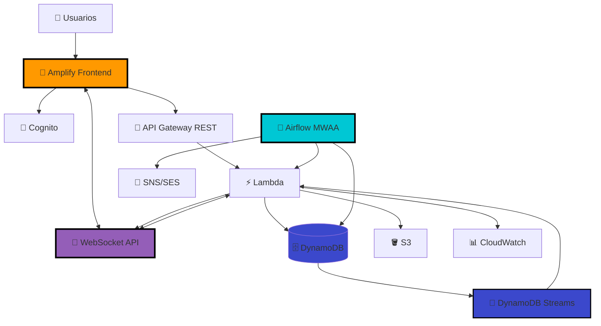

# Diagrama AlertaUTEC - Con Amplify, WebSocket y Airflow

## 🎯 Para Eraser.io

```
title AlertaUTEC - Arquitectura Serverless Completa (Amplify + WebSocket + Airflow)

// ============================================
// USUARIOS
// ============================================
Users [icon: users, color: blue] {
  Estudiantes
  Personal
  Autoridades
}

// ============================================
// FRONTEND - AMPLIFY (REQUISITO)
// ============================================
Amplify [icon: aws-amplify, color: orange] {
  AWS Amplify Hosting
  
  React Application
  CI/CD desde GitHub
  CloudFront CDN
  HTTPS automático
  
  WebSocket Client integrado
}

// ============================================
// AUTENTICACIÓN
// ============================================
Cognito [icon: aws-cognito, color: red] {
  Amazon Cognito
  User Pools
  
  Grupos:
    - Estudiantes
    - Personal
    - Autoridades
  
  JWT Tokens
}

// ============================================
// API REST
// ============================================
API Gateway REST [icon: aws-api-gateway, color: purple] {
  REST API
  
  POST /incidents
  GET /incidents
  GET /incidents/{id}
  PUT /incidents/{id}
  DELETE /incidents/{id}
  POST /presigned-url
}

// ============================================
// API WEBSOCKET (REQUISITO)
// ============================================
API Gateway WebSocket [icon: aws-api-gateway, color: purple] {
  WebSocket API
  
  $connect
  $disconnect
  $default
  
  Real-time < 100ms
}

// ============================================
// BACKEND LAMBDA
// ============================================
Lambda Functions [icon: aws-lambda, color: orange] {
  incident-handler
    - CRUD completo
    - Validación roles
  
  ws-connect
    - Guardar connectionId
  
  ws-disconnect
    - Eliminar conexión
  
  notify-changes
    - Trigger DynamoDB Stream
    - Broadcast a WebSockets
  
  classify-incident
    - Clasificación automática
}

// ============================================
// BASE DE DATOS
// ============================================
DynamoDB Tables [icon: aws-dynamodb, color: blue] {
  alertautec-incidents
    - PK: incidentId
    - Streams: ENABLED
    - Trigger: notify-changes
  
  alertautec-connections
    - PK: connectionId
    - WebSocket tracking
  
  alertautec-notifications
    - Historial notificaciones
}

DynamoDB Streams [icon: aws-dynamodb, color: blue] {
  Stream de cambios
  NEW_AND_OLD_IMAGES
  
  Trigger automático
  Lambda notify-changes
}

// ============================================
// STORAGE
// ============================================
S3 Buckets [icon: aws-s3, color: green] {
  alertautec-photos
    - Fotos incidentes
    - Presigned URLs
  
  alertautec-airflow
    - DAGs de Airflow
    - Logs
  
  alertautec-reports
    - Reportes generados
}

// ============================================
// ORQUESTACIÓN - AIRFLOW (REQUISITO)
// ============================================
Airflow [icon: airflow, color: teal] {
  Apache Airflow (MWAA)
  
  DAG: classify_incidents
    - Cada 5 minutos
    - Clasifica nuevos
    - Invoca Lambda
  
  DAG: send_notifications
    - Cada 10 minutos
    - Filtra críticos
    - Notifica autoridades
  
  DAG: generate_reports
    - Diario 23:00
    - Estadísticas
    - Upload a S3
  
  DAG: ml_training
    - Semanal (opcional)
    - Entrena modelos
}

// ============================================
// NOTIFICACIONES
// ============================================
SNS [icon: aws-sns, color: pink] {
  Amazon SNS
  
  Topic: critical-incidents
  Topic: general-updates
  
  Email, SMS
}

SES [icon: aws-ses, color: pink] {
  Amazon SES
  
  Email templates
  Notificaciones autoridades
}

// ============================================
// MONITOREO
// ============================================
CloudWatch [icon: aws-cloudwatch, color: red] {
  Logs centralizados
  
  Lambda logs
  API Gateway logs
  Airflow logs
  
  Métricas
  Alarmas
}

X-Ray [icon: aws-xray, color: purple] {
  Trazabilidad distribuida
  Performance insights
  Debugging
}

// ============================================
// MACHINE LEARNING (OPCIONAL)
// ============================================
SageMaker [icon: aws-sagemaker, color: green, style: dashed] {
  Amazon SageMaker (Fase 2)
  
  Notebooks
  Training Jobs
  Endpoints
  
  Clasificación automática
  Predicción urgencia
}

QuickSight [icon: aws-quicksight, color: purple, style: dashed] {
  Amazon QuickSight (Fase 2)
  
  Dashboards
  Analytics
  ML Insights
}

// ============================================
// FLUJOS PRINCIPALES
// ============================================

// 1. Acceso usuario
Users > Amplify : "1. HTTPS"
Amplify > Cognito : "2. Autenticación"
Cognito > Amplify : "3. JWT Token"

// 2. WebSocket Connection (TIEMPO REAL)
Amplify > API Gateway WebSocket : "4. WebSocket Connect"
API Gateway WebSocket > Lambda Functions : "5. ws-connect()"
Lambda Functions > DynamoDB Tables : "6. Save connectionId"

// 3. Crear incidente (REST API)
Amplify > API Gateway REST : "7. POST /incidents"
API Gateway REST > Cognito : "8. Validate JWT"
API Gateway REST > Lambda Functions : "9. incident-handler()"
Lambda Functions > DynamoDB Tables : "10. PutItem"
Lambda Functions > S3 Buckets : "11. Upload foto (presigned)"

// 4. Tiempo Real Update
DynamoDB Tables > DynamoDB Streams : "12. Change event"
DynamoDB Streams > Lambda Functions : "13. Trigger notify-changes()"
Lambda Functions > DynamoDB Tables : "14. Get connections"
Lambda Functions > API Gateway WebSocket : "15. PostToConnection"
API Gateway WebSocket > Amplify : "16. Push update"

// 5. Orquestación Airflow
Airflow > Lambda Functions : "17. Invoke classify-incident"
Airflow > DynamoDB Tables : "18. Query pending"
Airflow > SNS : "19. Publish critical"
Airflow > S3 Buckets : "20. Upload reports"
SNS > SES : "21. Send emails"

// 6. Monitoreo
Lambda Functions > CloudWatch : "Logs"
API Gateway REST > CloudWatch : "Logs"
API Gateway WebSocket > CloudWatch : "Logs"
Airflow > CloudWatch : "Logs"
Lambda Functions > X-Ray : "Traces"

// 7. ML (Fase 2)
Lambda Functions > SageMaker : "Predict" [style: dashed]
SageMaker > S3 Buckets : "Models" [style: dashed]
DynamoDB Tables > QuickSight : "Analytics" [style: dashed]

// ============================================
// NOTAS Y LEYENDA
// ============================================

// REQUISITOS OBLIGATORIOS:
// ✅ AWS Amplify (Frontend)
// ✅ WebSocket API (Tiempo real)
// ✅ Apache Airflow (Orquestación)

// Líneas sólidas: Implementado
// Líneas punteadas: Fase 2 (opcional)
```

---

## 📊 Versión Simplificada para Presentación

```
title AlertaUTEC - Flujo Principal

Users [icon: users] 
Amplify [icon: aws-amplify, label: "Frontend React"]
Cognito [icon: aws-cognito, label: "Auth"]
API REST [icon: aws-api-gateway, label: "REST API"]
API WebSocket [icon: aws-api-gateway, label: "WebSocket"]
Lambda [icon: aws-lambda, label: "Functions"]
DynamoDB [icon: aws-dynamodb, label: "Database"]
Streams [icon: aws-dynamodb, label: "Streams"]
S3 [icon: aws-s3, label: "Storage"]
Airflow [icon: airflow, label: "MWAA"]
CloudWatch [icon: aws-cloudwatch, label: "Logs"]

// Flujo principal
Users > Amplify : "Web"
Amplify > Cognito : "Login"
Amplify > API REST : "CRUD"
Amplify > API WebSocket : "Real-time"

API REST > Lambda
API WebSocket > Lambda

Lambda > DynamoDB
Lambda > S3

DynamoDB > Streams
Streams > Lambda
Lambda > API WebSocket
API WebSocket > Amplify

Airflow > Lambda
Airflow > DynamoDB

Lambda > CloudWatch
```

---

## 🎨 Para PowerPoint (Descripción Textual)

### Componentes Clave (Capa por capa):

**CAPA 1: Usuarios**
- 👥 Estudiantes, Personal, Autoridades

**CAPA 2: Frontend (REQUISITO)**
- 🚀 **AWS Amplify**: React app, CI/CD desde GitHub, CloudFront CDN

**CAPA 3: Autenticación**
- 🔐 **Amazon Cognito**: User pools, JWT tokens, roles

**CAPA 4: APIs**
- 🔌 **API Gateway REST**: CRUD endpoints
- 🔌 **API Gateway WebSocket** ⭐: Tiempo real <100ms (REQUISITO)

**CAPA 5: Backend**
- ⚡ **Lambda Functions**: 
  - incident-handler (CRUD)
  - ws-connect, ws-disconnect
  - notify-changes (Stream trigger)
  - classify-incident

**CAPA 6: Datos**
- 🗄️ **DynamoDB**: 
  - Tabla incidents (con Streams ⭐)
  - Tabla connections (WebSocket)
- 📡 **DynamoDB Streams**: Trigger para notificaciones en tiempo real

**CAPA 7: Storage**
- 🪣 **S3**: Fotos, DAGs de Airflow, reportes

**CAPA 8: Orquestación (REQUISITO)**
- 🔄 **Apache Airflow (MWAA)** ⭐:
  - DAG: Clasificación cada 5 min
  - DAG: Notificaciones cada 10 min
  - DAG: Reportes diarios

**CAPA 9: Notificaciones**
- 📧 **SNS + SES**: Emails y SMS

**CAPA 10: Monitoreo**
- 📊 **CloudWatch**: Logs y métricas
- 🔍 **X-Ray**: Trazabilidad

### Flujos Destacados:

**Flujo 1: Tiempo Real con WebSocket ⭐**
```
Incidente actualizado → DynamoDB → Stream → Lambda notify-changes 
→ WebSocket API → Push a todos los clientes conectados → Update UI
```

**Flujo 2: Orquestación con Airflow ⭐**
```
Cron schedule → Airflow DAG → Lambda classify → DynamoDB update 
→ Stream → WebSocket → Frontend actualizado
```

**Flujo 3: Amplify CI/CD ⭐**
```
Git push → GitHub → Amplify webhook → Build automático 
→ Deploy → CloudFront CDN
```

---

## 🛠️ Iconos y Colores AWS

### Paleta de Colores:
- **Amplify**: `#FF9900` (naranja) ⭐
- **Cognito**: `#DD344C` (rojo)
- **API Gateway**: `#945EB8` (púrpura)
- **Lambda**: `#FF9900` (naranja)
- **DynamoDB**: `#3B48CC` (azul) ⭐
- **S3**: `#569A31` (verde)
- **Airflow**: `#00C7D4` (cyan) ⭐
- **SNS/SES**: `#FF4F8B` (rosa)
- **CloudWatch**: `#FF4F8B` (rosa)

### Íconos (usar oficiales de AWS):
Descargar de: https://aws.amazon.com/architecture/icons/

---

## 📐 Versión Mermaid (para GitHub)



---

## ✅ Checklist para el Diagrama Final

- [ ] **Amplify** claramente visible como frontend
- [ ] **WebSocket API** diferenciado de REST API
- [ ] **DynamoDB Streams** conectado a Lambda notify
- [ ] **Airflow** con 3-4 DAGs listados
- [ ] Flujo numerado paso a paso
- [ ] Leyenda: Sólido vs Punteado
- [ ] Colores consistentes con AWS branding
- [ ] Título: "AlertaUTEC - Arquitectura Serverless Completa"
- [ ] Nota: "Cumple requisitos: Amplify ✅ WebSocket ✅ Airflow ✅"

---

## 💡 Tips para la Presentación

### Destacar los 3 Requisitos:

1. **AWS Amplify** 🚀:
   - "Frontend hosteado en Amplify con CI/CD automático"
   - "CloudFront CDN para baja latencia global"
   - Mostrar URL en vivo

2. **WebSocket API** 🔌:
   - "Tiempo real verdadero, sub-100ms"
   - Demo: Abrir 2 navegadores, actualizar en uno, ver cambio instantáneo en otro
   - "DynamoDB Streams trigger Lambda que hace broadcast a todos"

3. **Apache Airflow** 🔄:
   - "Orquestación de 3 workflows automatizados"
   - Mostrar Airflow UI con DAGs activos
   - "Clasificación cada 5 min, reportes diarios"

### Frase para Cierre:

> "Nuestra arquitectura cumple con todos los requisitos técnicos: **Amplify** para frontend moderno, **WebSockets** para tiempo real sub-segundo, y **Airflow** para orquestación robusta. Todo 100% serverless y escalable."

---

**🚀 ¡Arquitectura completa con los 3 requisitos obligatorios!**
